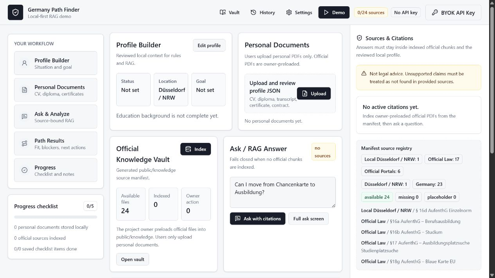
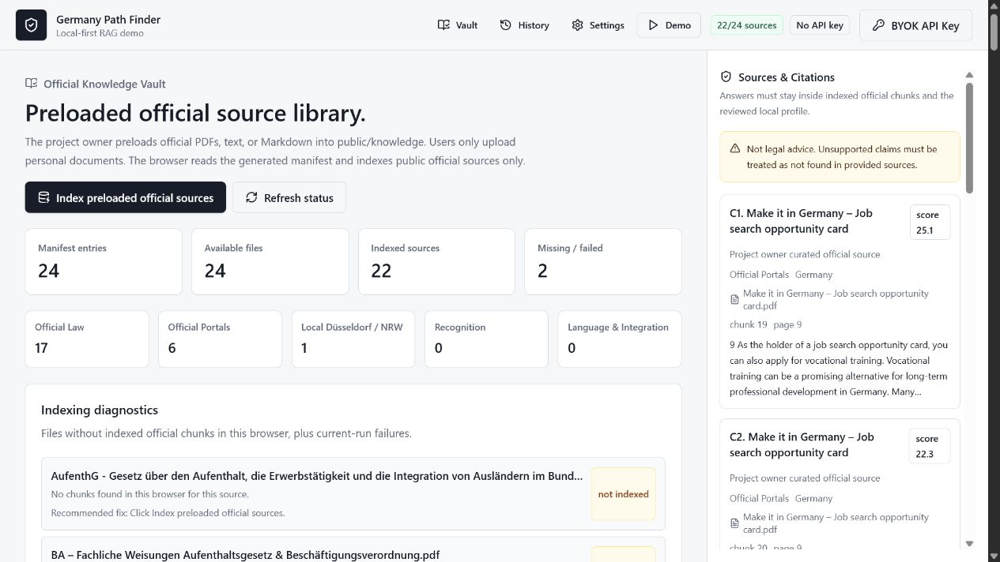
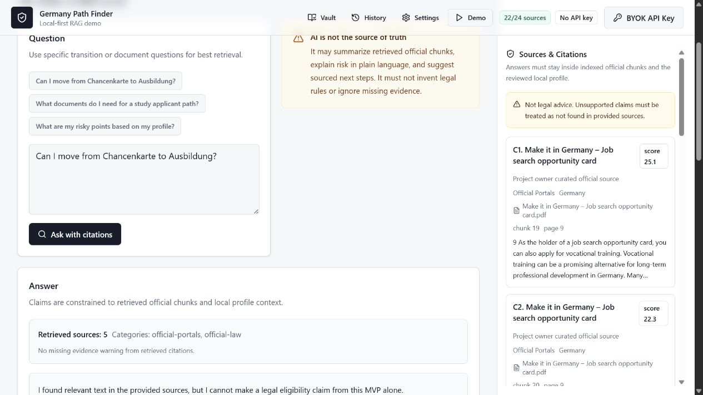

# Germany Path Finder

Live Demo: https://germany-path-finder.vercel.app/

Germany Path Finder is a local-first RAG portfolio MVP for exploring residence and career transition paths in Germany with owner-curated official sources, user-reviewed profile data, and source-bound AI explanations.

It is not legal advice. It is a decision-support demo that keeps official evidence, private user documents, and AI explanations separated.



## Live Demo

https://germany-path-finder.vercel.app/

## Screenshots





## Portfolio Walkthrough

1. The project owner preloads official PDFs, text, or Markdown files into `public/knowledge`.
2. A Node script generates a static official source manifest before dev/build.
3. The browser parses PDFs with `pdfjs-dist`, chunks text, and stores official chunks in IndexedDB.
4. Users upload only personal documents for local profile extraction and review.
5. Ask/RAG retrieves official chunks first, shows citations, and fails closed when sources do not support a claim.
6. Path Results combines transparent rules, profile fit, source coverage, and conservative risk labels.

## What This Demonstrates

- Transparent residence/career path rules
- Local-first RAG over owner-curated official sources
- Separation between public official knowledge and private user documents
- Source-bound answers with citations
- BYOK AI workflow
- Conservative eligibility/risk handling instead of legal claims

## RAG, BYOK, And Local-First

The app has no backend, login, payment, or server database. Official source chunks, reviewed profile data, progress, and notes are stored in the browser.

BYOK settings support OpenAI-compatible providers, including OpenAI and Gemini's OpenAI-compatible endpoint. If AI is unavailable, the app still shows a source-bound retrieval fallback with citations.

Official RAG only uses chunks where:

- `source_type === "official_knowledge"`
- `official === true`
- `user_scope === "public"`

Private uploaded documents and `public/sample-user-vault` files are never indexed into global official source chunks.

## Add Official PDFs

Project owners add official `.pdf`, `.txt`, or `.md` files under:

- `public/knowledge/official-law/`
- `public/knowledge/official-portals/`
- `public/knowledge/local-duesseldorf/`
- `public/knowledge/recognition/`
- `public/knowledge/language-integration/`

Optional sidecar metadata can sit beside a file:

```text
public/knowledge/official-law/AufenthG.pdf
public/knowledge/official-law/AufenthG.json
```

Example sidecar:

```json
{
  "title": "Official document title",
  "authority": "Official authority name",
  "jurisdiction": "Germany",
  "date_checked": "2026-07-08",
  "sourceUrl": "https://official.example/source-page",
  "documentType": "official-pdf",
  "tags": ["residence", "documents", "study"],
  "language": "de"
}
```

Then regenerate manifests:

```bash
npm run generate:knowledge
```

## Run Locally

```bash
npm install
npm run dev
```

Build:

```bash
npm run build
```

`npm run dev` and `npm run build` both regenerate knowledge manifests first.

## Privacy Notes

User profile data, uploaded document text, chunks, checklist progress, notes, and BYOK settings stay in the browser.

If AI is enabled, selected document/profile context and retrieved source chunks may be sent to the selected provider only when the user runs extraction or asks a question. Do not use sensitive documents on public or shared devices.

## Disclaimer

Germany Path Finder is not legal advice, immigration advice, or a replacement for official authorities or a qualified lawyer. It does not claim eligibility. It highlights source evidence, missing evidence, and verification needs.

## Future Improvements

- OCR for scanned PDFs
- Local embeddings or browser-side vector search
- Better source metadata curation
- Exportable evidence packs
- Region-specific rule packs maintained from official citations
